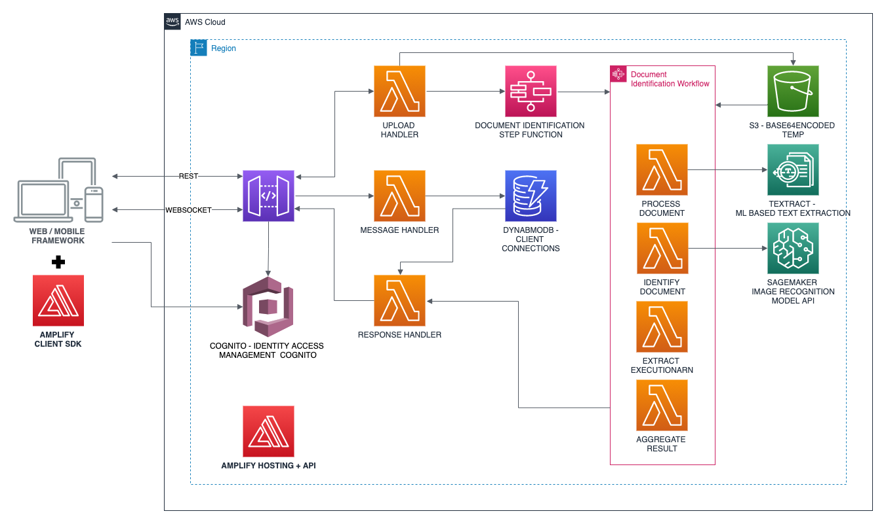

# SWIFT#4 - Smart Document Identification

This Smart Document Identification application is a machine learning powered application that is able to identify National ID, Driving License and Passport from 5 countries (Indonesia, Malaysia, Philippines, Thailand and Vietnam). This document identification leverages two methods of classification: image based identification and text based identification. This application is built using AWS Amplify with support from Amazon SageMaker and Amazon Textract works under the hood to classify uploaded images.

## Architecture

